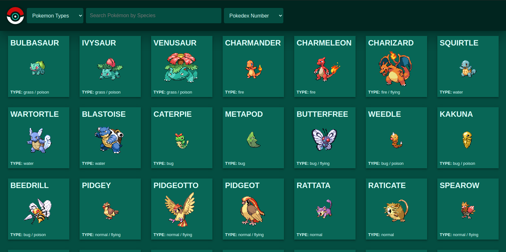

## Micro-Dex

This is a super basic poke-dex application. For the moment, it will only search, filter and sort pokemon by type and name, and order them by pokedex number, by name or by type (alphabetically). 

This project was bootstrapped with [Create React App](https://github.com/facebook/create-react-app).

## Built With:

- Javascript
- React
- Redux

## Author

👤 **Miguel Dubois**

- Github: [@MiguelDP4](https://github.com/MiguelDP4)
- Twitter: [@Mike_DP4](https://twitter.com/Mike_DP4)
- LinkedIn [Miguel Dubois](https://www.linkedin.com/in/miguel-angel-dubois)

## Features

- Pokemon are loaded and organized when the application is loaded.
- You can search for pokemon by typing their name on the text input on the navigation bar.
- You can filter pokemon by type by selecting a type on the drop down box on the navigation bar.
- You can order the pokemon by either name, pokedex number or type with the dropdown on the navigation bar.

## Planned future features

- Display more pokemon data (evolution lines, links to that pokemon's evolution, attacks it can learn, etc).
- Ask user permission to use local storage so the page doesn't need to load every time.
- User account creation so users can create pokemon teams

## Live Demo

You can check a demo version of the project in [this link](http://micro-dex.herokuapp.com/).

### Demo images

Coming soon

# 🤝 Contributing

This project is for learning purposes only, I wont accept contributions, though suggestions are welcome.

## Show your support

Give a ⭐️ if you like this project!

## Acknowledgments

- I thank microverse for this amazing learning opportunity.
- This project could not have been created without https://pokeapi.co/. You can visit the site by clicking on the link.
- Pokeapi was created by [Paul Hallet](https://github.com/phalt), you can check his github by clicking on his name. Thank you very much for the API Paul.
- Want to know more about the API? You can check more information here https://pokeapi.co/about

## Available Scripts

In the project directory, you can run:

### `npm start`

Runs the app in the development mode. 
Open [http://localhost:3000](http://localhost:3000) to view it in the browser.

The page will reload if you make edits. 

### `npm test`

Launches the test runner in the interactive watch mode. 
See the section about [running tests](https://facebook.github.io/create-react-app/docs/running-tests) for more information.

### `npm build`

Builds the app for production to the `build` folder. 
It correctly bundles React in production mode and optimizes the build for the best performance.

The build is minified and the filenames include the hashes. 
Your app is ready to be deployed!

See the section about [deployment](https://facebook.github.io/create-react-app/docs/deployment) for more information.

